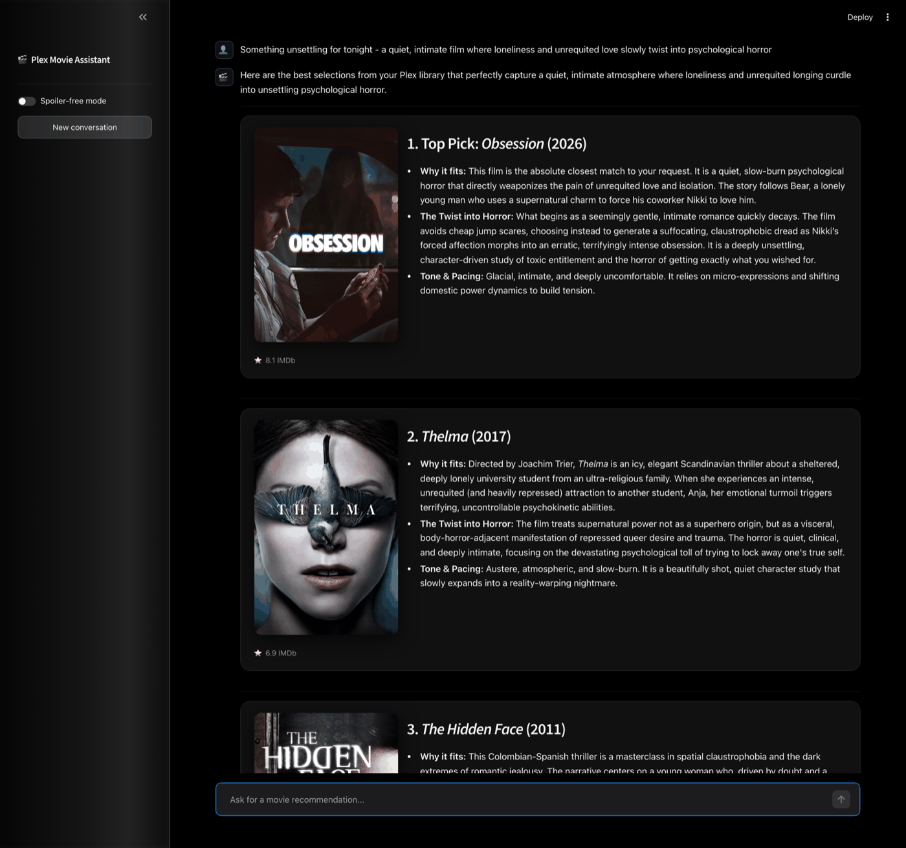

# plex-rag

A conversational movie recommendation chatbot that only recommends movies you actually have in your personal Plex library.

## Purpose

Owning a large Plex library doesn't solve "what should I watch tonight" — the
library isn't discoverable by mood, theme, or taste, and generic recommendation
engines suggest things you don't own. `plex-rag` is a chat assistant that reasons
about your library the way a knowledgeable friend or critic would: it
understands vibe- and taste-based requests ("something like Parasite but
lighter"), not just keyword search, and it is hard-constrained to only ever
suggest films you can actually press play on.

It's one half of a two-repo project: this repo is the **query-time / serving**
half (the chat app, in two front ends), while the sibling repo `plex-ingest`
keeps the underlying library data up to date — see [Data source](#data-source)
below for how the two connect.

The core design bet is that a single retrieval strategy isn't enough to serve
every kind of question. A plot-driven question ("something with a heist gone
wrong") needs synopsis search; a vibe-driven question ("moody, slow-burn,
Kubrick-esque") needs matching on critic-style vocabulary that no synopsis
contains. So instead of picking one retrieval method, this app runs four in
parallel every turn and merges their results — see the retriever breakdown
below.

## What it does

### Conversational recommendations

Ask questions like "what should I watch tonight?" or "something like Parasite but lighter" and get back ranked, reasoned recommendations. Available as both a browser UI and a CLI. Under the hood:

- **Query rewriting** — follow-up questions ("what about something shorter?") are rewritten into standalone queries using conversation history, so context carries through multi-turn conversation.
- **Quad retrieval** — four strategies run in parallel and their results are grouped by film and deduplicated:
  - *Direct synopsis retriever*: your query is embedded directly and searched against synopsis embeddings — reliable for plot-specific and meta queries (language, cast, content rating) where thematic vocabulary is less useful.
  - *HyDE retriever*: the LLM generates a dense expert film profile matching your request (subgenre labels, director influences, tone descriptors, cinematic movements), then finds real movies whose enrichment embeddings are closest to that hypothetical profile — surfaces films that match the *critic vocabulary* of your request rather than its surface words.
  - *LLM knowledge retriever*: the LLM uses its film expertise to scan your full movie list and select candidates by director, subgenre, cultural context, tone, etc. — great for queries like "classic Kubrick-esque films." (Scales well up to a few hundred titles in the list.)
  - *Enrichment retriever*: your query is embedded directly and searched against the pre-computed expert profiles — craft, meaning, and context sections — bringing in retrieval signal that doesn't exist in any synopsis, such as cinematographer names, movement labels, thematic keywords, and tone descriptors.
- **Grouped context** — retrieved documents are assembled per film with candidates in randomised order (to avoid position bias), synopsis first and enrichment sections following within each film block. Each film gets a single block in the context window, so the generator sees the full picture for each candidate.
- **Recommendation generation** — the merged candidates are passed to Gemini, which ranks them and explains specifically why each fits, referencing themes, pacing, and director style. It acknowledges weak matches rather than overselling.
- **Spoiler-free mode** (`--no-spoilers`) — same flow, but the generator reasons only from genre, tone, cast, and style — never plot details or story outcomes.

The strict constraint throughout is that it only recommends movies from your library — the generator prompt explicitly forbids suggestions outside the retrieved candidate set.

### Web UI

A NiceGUI browser interface for the recommendation chat. Runs locally and serves the app at `http://localhost:8080`.



- **Chat interface** — multi-turn conversational recommendations with full history
- **Movie cards** — each recommendation renders as a poster image alongside the reasoning, with IMDb rating below
- **Spoiler-free toggle** — switch modes without leaving the browser
- **New conversation** — reset chat history in one click

## Data source

This repo is recommender-only. Your Plex library is synced, scraped, LLM-enriched,
and embedded into Qdrant by a separate sibling project, `plex-ingest`
(Dagster-based) — that repo owns the Plex connection, all scraping, enrichment
generation, and every write to the vector store. `plex-rag` connects to the
Qdrant collection `plex-ingest` populates, read-only, over the network. See
[docs/vector-store-contract.md](docs/vector-store-contract.md) for the data
contract between the two repos.

## Setup

### Prerequisites

- Python 3.14+
- A Google Gemini API key
- A running Qdrant instance populated by `plex-ingest` (or pointed at during local dev)

### Environment variables

Create a `.env` file in the project root (or export these in your shell):

| Variable | Required | Description |
|---|---|---|
| `GOOGLE_API_KEY` | Yes | Google Gemini API key — used for embeddings and generation |
| `QDRANT_URL` | No | URL of the Qdrant server `plex-ingest` populates (default: `http://localhost:6333`) |
| `QDRANT_COLLECTION` | No | Qdrant collection name (default: `media_items`) |
| `NICEGUI_STORAGE_SECRET` | No | Encrypts the web UI's per-browser-tab storage (default: a fixed dev value — set a real value in production) |
| `PYTHONPATH` | No | Set to the project root if running without `uv run` or the installed CLI |

### Install

```bash
uv sync
```

## Usage

### Web UI

```bash
uv run python nicegui_app/main.py
```

Opens at `http://localhost:8080`.

### CLI

```bash
# Start an interactive recommendation session in the terminal
plex-rag chat

# Start in spoiler-free mode
plex-rag chat --no-spoilers

# Show retriever source coverage after each response (for debugging bias)
plex-rag chat --verbose
```

## Architecture

```
app/
├── cli.py                      # Typer CLI entrypoint
├── rag.py                      # CLI chat entrypoint: input loop over build_recommender_service
├── bootstrap.py                # build_recommender_service: shared composition root (CLI + NiceGUI)
├── config.py                   # env-driven settings
├── domain/
│   ├── recommender.py          # MovieRecommender: orchestrates retrieve → generate
│   └── ports.py                # Interfaces: CandidateRetriever, RecommendationGenerator, QueryRewriter, MediaItemLookup
├── adapters/
│   ├── retrievers.py           # DirectSynopsisRetriever, HyDEVectorRetriever, LLMKnowledgeRetriever, LLMEnrichmentRetriever
│   └── generators.py           # GeminiRecommendationGenerator, GeminiQueryRewriter
├── services/
│   └── recommendation.py       # ConversationalRecommendationService (manages chat history)
├── repositories/
│   ├── qdrant_media_items.py   # QdrantMediaItems: MediaItem lookup sourced from Qdrant payloads
│   └── vector_store.py         # read-only Qdrant connect + preflight checks
├── formatting/
│   └── sections.py             # parse_sections/split_trailing_notes: LLM response → per-film sections (framework-agnostic)
└── models/
    └── media_item.py           # MediaItem dataclass (read-side shape)

nicegui_app/
├── main.py                     # NiceGUI entrypoint — layout, per-tab storage, chat loop, ui.run()
├── service_cache.py            # get_service: cache around app.bootstrap.build_recommender_service, keyed by spoiler_free
├── components.py                # render_recommendations/render_chat_row: build chat rows and per-film poster + text cards
└── styles.py                   # dark theme CSS matching the original Streamlit look
```

See [docs/recommender.md](docs/recommender.md) for a deeper walkthrough of the
recommendation pipeline, and [docs/vector-store-contract.md](docs/vector-store-contract.md)
for the Qdrant payload shape this repo reads.
